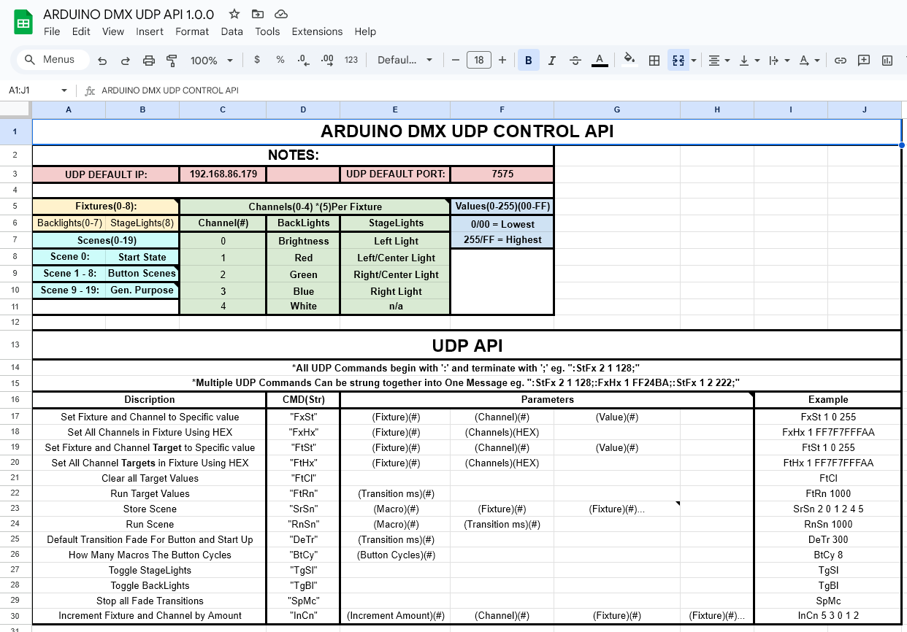

# Atmega328P LightControl - Amir Gorkovchenko (Late 2021, Late 2023)

Control DMX lights with a simple Arduino via UDP.

The purpose was to allow for easy DMX control using a cheap and readily available Atmega328p MCU.

## Device Overview
This project consists of a single device that communicates over Ethernet and control light using DMX

A large challenge in this project was getting around the Atmega328P's limitations, namely processing speed and RAM Size (2KB).

### CPU
DMX proved to be a very demanding protocol for this processor that hardly gave any idle time to the CPU for Network processing and Light Macros (Fading effects)

### RAM
Considering a single DMX Universe contains 512 addressable channels (which requires 512 bytes) and the Network stack can take as much as 1.5KB (depending which Network Stacks and how many ports were utilized), 2KB was not enough to fully implement this project.
Certain shortcuts needed to be made where only a section of the DMX channels where actually being used.

### Operation
The device listens to Ethernet commands over UDP that can be easily trigger from anywhere.
This also gives the option for a specific boot up light sequence.

A single external button was also added to implant in the wall as an easy to use switch and user friendliness.
It provided with very basic commands like fade on/off and change splash light color.

All configuration was stored on EEPROM memory and with configuration can be changed using UDP commands.

## UDP API Map:
